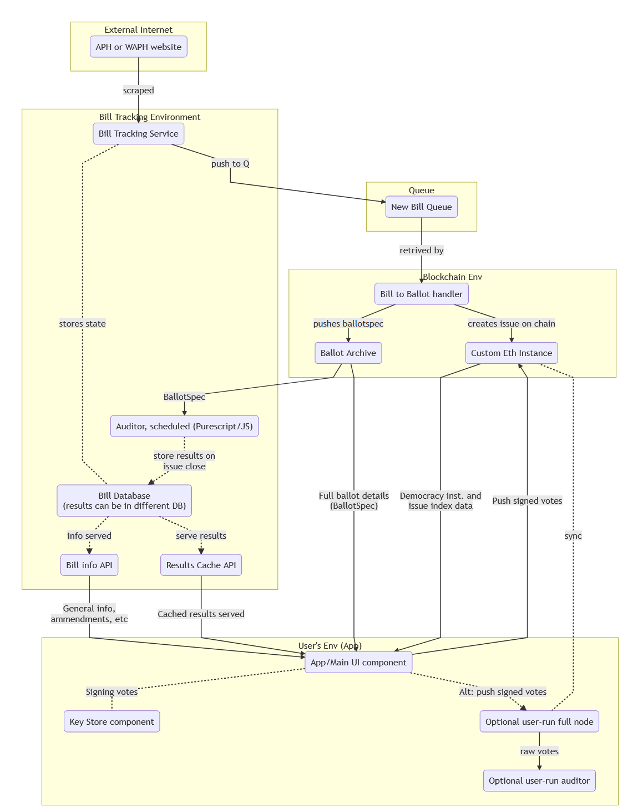

# DigiPol

## Parliament of the People

_NOTE: App is in pre-Alpha - We welcome criticism, if you think you can improve the structure, please fork and do a pull request_

**Attention:** Alpha testers, please read [this guide](docs/ALPHATESTING.md).

Join us on

[](https://discord.gg/xFMUTZw) <!-- .element height="50%" width="50%" -->

--------------------------------------------------------------------------------

## Primary Program Objectives

The DigiPol Voting App (temporary name for now) will allow Australian Voters to be able to vote on current _issues_ and _bills_ within the political landscape.

- **Bills** will be the legislation proposals put forth in Parliament, worded as is.
- **Issues** will be generated according to public interest and contemporary topics as they arise.

It will collate voting results and show users the results of their electorates voting on bills. It will allow them to send an automatically generated email to their elected representative, as well as post the results out onto various social media.

### Sample


# The App Architecture

## Front end

The app frontend is built with [Flutter](https://flutter.dev/) using the Dart Programming Language. This repo will focus entirely on this part of the project.

## Back end

- The app backend is built using multiple serverless lambdas to interact with mongodb and other external services. **(NOTE: This repo will only cover the UI Architecture, for information on the backend head over to [Voting-app-api](https://github.com/KipCrossing/voting-app-api)**
- Databases and API are managed on AWS using lambda functions Data for Bills are mirrored from the federal and state parliament websites using the [ausbills](https://github.com/KipCrossing/Aus-Bills) python package
- The app will utilise the Ethereum blockchain to validate votes.
- Issues are manually entered into the database for now

# Flutter Architecture

_This section assumes you have basic understanding of Flutter. If you are new to Flutter see the bottom of the repo for resources_.

The app uses a [Provider](https://flutter.dev/docs/development/data-and-backend/state-mgmt/simple) Architecture for state management. It is structured so data flows to only the views that need it. _The apps structure was inspired by this [Filledstacks](https://www.filledstacks.com/post/flutter-architecture-my-provider-implementation-guide/) guide. If you are new to flutter and plan on contributing we highly recommend you check out this tutorial._

The idea behind the directory architecture is to abstract the logic away from the UI. This allows for more maintainable code and extensibility. Simply as is sounds, any app logic goes into the Core any UI goes into the UI.

**High level Architecture Points**

- Each view will have it's own model that extends the ChangeNotifier.
- Notify listeners for a view will ONLY BE CALLED when the View's state changes.
- Each view only has 2 states. Idle and Busy. Any other piece of UI contained in a view, that requires logic and state / UI updates will have it's own model associated with it. This way the main view only paints when the main view state changes.
- Providers will NOT be passed in through app level global provider, unless it's required by more than 1 view in the app architecture (Users information).
- Models will ONLY request data from Services and reduce state from that DATA. Nothing else.

--------------------------------------------------------------------------------

## Core

All app logic is contained in this directory.

- **models** - Contains all the plain data models
- **services** - Contains the dedicated files that will handle actual app logic
- **viewmodels** - Contains the Provider models for each of the Widget views
- **enums** - Storing any reusable enums

## UI

Any UI element or styling feature is contained here. Avoid using app logic in this folder or any descendant.

- **views** - Contains any full screen that is used in the app
- **widgets** - Contains any resuable widgets.

### Views

- **All issues view** - List of issues generated, sortable by date, popularity, controversiality(?)
- **All bills view** - List of bills sortable by house, date, progress
- **Bill page with voting option** - Full description/links and voting buttons
- **Login Page** - email - password
- **Results Page** - List of horizontal bar graphs - 1 for each electorate
- **Verification/Settings Page** - AEC details, electorate details, representatives and voting patterns, join Flux button, link Settingss (google/fb/ig)

--------------------------------------------------------------------------------

## Contributing

We are planning on implementing [C4](docs/CONTRIBUTING.md)

A list of current items and their progress can be found [here](https://github.com/voteflux/voting_app/projects/1). If you feel comfortable diving straight in, just fork the repo, and open it up in Android Studio.

We use [Effective Dart](https://dart.dev/guides/language/effective-dart) to guide our coding style, so make sure you make yourself familiar. Make the contributions you want to and create a Pull Request.

For collaborating, best practice is to join our _Discord Community_ at [discord.io / FluxParty](discord.io/FluxParty) and let us know where you're interested in helping out. That way we can make sure you are up to date with all the relevant information and put you in contact with others working on the project!

If you are new to Flutter here are a few resources to get you started on your first Flutter project:

- [Lab: Write your first Flutter app](https://flutter.dev/docs/get-started/codelab)
- [Cookbook: Useful Flutter samples](https://flutter.dev/docs/cookbook)
- [online documentation](https://flutter.dev/docs), which offers tutorials, samples, guidance on mobile development, and a full API reference.

### Getting started

Install dependencies:

```
sudo apt install curl
```

Get flutter (copy in all lines):

**WARNING:** you must use a version of flutter >= 1.16.2, the easiest way to do this is use the `beta` channel; **builds will fail if you're using `stable` channel.**

```
git clone https://github.com/flutter/flutter.git -b beta && \
echo '#Add Flutter to PATH' >> $HOME/.bashrc && \
echo 'export PATH="$PATH:'$(pwd)'/flutter/bin"' >> $HOME/.bashrc && \
export PATH="$PATH:'$(pwd)'/flutter/bin && \
echo "Check the flutter is in path" && \
echo $PATH && \
flutter precache && \
echo "Check your dependencies:" && \
flutter doctor
```

Download and install [Android Studio](https://developer.android.com/studio) and install the Flutter plugin:

Run `flutter doctor` again to check dependencies.

#### For web dev:

```
flutter config --enable-web
```

(If you're not already on the beta channel run `flutter channel beta && flutter upgrade`)

Make sure you have Chrome installed

**BUG NOTICE**: You may need to edit a file in the flushbar Dart Package if you get this error:

```shell script ../../../.pub-cache/hosted/pub.dartlang.org/flushbar-1.9.1/lib/flushbar_route.dart:281:18: Error: Too many positional arguments: 0 allowed,

```

See [This Issue](https://github.com/AndreHaueisen/flushbar/issues/113) to make the fix. This is because we are using the master branch of flutter soe we can do web dev.
```

flutter devices

````

And Run `flutter run -d chrome` in the project dir.

--------------------------------------------------------------------------------

## Future Plans (Beta)

- Graphs (Public Voice)
- Commenting on Bills
- Weekly Reports
- Politi Compass - Personalised Voting History
- Create Issues UI
- User Settingss
- Settings - Notifications, Emails
- sorting bills - Date, title, chamber
- Search bar
- results map

----------

## CICD

* GitHub --(webhook)--> GitLab CE (cicd project)
  - mirror clone github.com/voteflux/voting_app
  - push to gitlab repo
* GitLab CE (main project) -- cicd triggers normally
  - runs .gitlab-ci.yaml pipelines
  - reports status back to github
* Avoid multiline scripts in gitlab-ci.yml; use named scripts under `./ci/` instead.

### macos codesigning

> **Note: substantial criticism and improvements very welcome**

The codesigning setup is roughly:

* a gitlab runner instance running under user `runner`
* a `codesign` user with xcode set up and things
* very restricted `sudo -u codesign` access for runner

Problems:

* unlocking the keychain seems to be problematic
* needed to add -allowProvisioningUpdates to last line of do-flux-codesign
* provisioning profiles are not intuitive, well documented, etc

## Architecture Overview



### Missing components

* voter sign up / validation process
* voter roll management
* integrations w/ member stuff
* email / notification things
* comments / discussion / submission features
* etc

<!-- can't put  mermaid.js code straight in an HTML comment because
it uses the closing tag in its syntax. And can't display:none it apparently :/
so we'll just include it all for the moment. Figure out something better later -->

### about this chart

The flowchart was generated with mermaid.js

See: https://mermaid-js.github.io/mermaid/#/flowchart and https://github.com/mermaid-js/mermaid

Live editor: https://mermaid-js.github.io/mermaid-live-editor/

current source code:

```mermaid
graph TB

subgraph External Internet
    PH(APH or WAPH website)
end

subgraph Queue
    BillQ(New Bill Queue)
end

subgraph "User's Env (App)"
    App(App/Main UI component)
    KeyStore(Key Store component)

    UserNode(Optional user-run full node)
    UserAuditor(Optional user-run auditor)
end

subgraph Bill Tracking Environment
    BillTracker(Bill Tracking Service)
    BillDB("Bill Database<br/>(results can be in different DB)")
    BillApi(Bill info API)
    ResultsCacheApi(Results Cache API)
    AuditJob("Auditor, scheduled (Purescript/JS)")
end

subgraph Blockchain Env
    BillToBallot(Bill to Ballot handler)
    PrivChain(Custom Eth Instance)
    BallotArchive(Ballot Archive)
end

PH -->|scraped| BillTracker
BillTracker -->|push to Q| BillQ
BillTracker -.-|stores state| BillDB
BillDB -.->|info served| BillApi

AuditJob -.->|store results on<br/>issue close| BillDB
BillDB -.->|serve results| ResultsCacheApi

BillQ -->|retrived by| BillToBallot
BillToBallot -->|creates issue on chain| PrivChain
BillToBallot -->|pushes ballotspec| BallotArchive

BillApi -->|General info,<br/>ammendments, etc| App
ResultsCacheApi -->|Cached results served| App
App -.-|Signing votes| KeyStore
App -->|Push signed votes| PrivChain
App -.->|Alt: push signed votes| UserNode
BallotArchive -->|"Full ballot details<br/>(BallotSpec)"| App
PrivChain -->|Democracy inst. and<br/>issue index data| App

BallotArchive -->|BallotSpec| AuditJob

UserNode -.-|sync| PrivChain
UserNode -->|raw votes| UserAuditor
````
