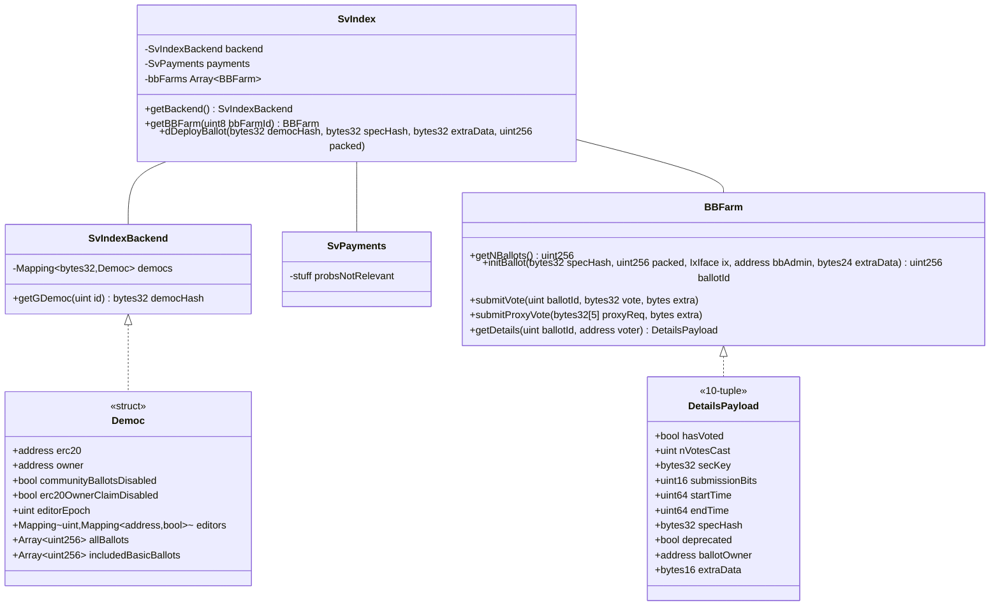

# Blockchain details

## Smart Contract system

### Things to know

* membership lists are compatible with erc20 contracts; particularly, the "voting weight" of a voter is decided through the `balanceOf` function -- that's the only required method (though maybe the abbreviation and decimal places are required too; **TODO**)

* the democ we'll use (identified via the `democHash`) will be provided, but it'll also be at index 0, so :shrug:

### system summary

* queries have no single entrypoint (solidity / ABI restriction); query wherever the data is
* A "democracy" is, in essence, anything with a single set of admins; membership lists can be per-issue within a democracy (though from memory there is a default erc20 contract, **TODO**)
* democracies have "ballot boxes" (also referred to as ballots or issues) attached to them
* ballots are instantiated via `BBFarm`s -- ballot box factories, essentially (they create the voting contract itself, or in some cases are used directly I think **TODO**)
* users submit votes to the ballot box contract / voting contract
* votes are looked up via the bb contract / voting contract
* some auxilary contracts are used to make queries nicer (i.e. returning a list of all votes rather than needing to query the voting contract N times)
* a payments system is integrated to the system, but the price should be set to 0 and free-ballots enabled, there are a few settings that need to be set correctly but I think this is handled automatically in @voteflux/voting-alpha (will be in chaincode setup in cfn stack)

### finer details

* the `packed` struct for ballots is a collection of bit-flags about properties of the ballot; we won't use any more than 1 value for packed at this stage; **TODO: provide value if needed**

### code

https://github.com/secure-vote/sv-light-smart-contracts

### diags

Note: this is an incomplete description of the ABI structures, so check files like [SVIndex.sol](https://github.com/secure-vote/sv-light-smart-contracts/blob/master/contracts/SVIndex.sol) and [SVIndexBackend.sol](https://github.com/secure-vote/sv-light-smart-contracts/blob/master/contracts/SVIndexBackend.sol) if you want full details

